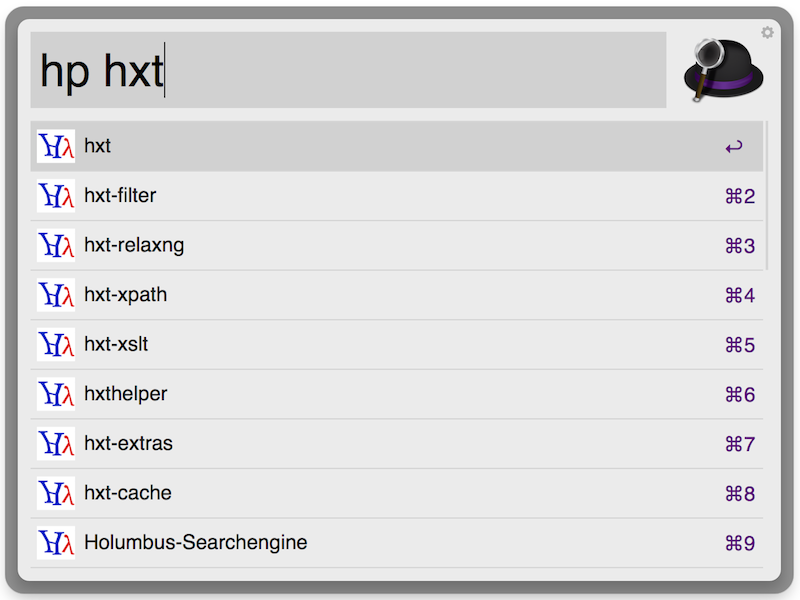

# Search Hayoo using Alfred 2

This workflow lets you search [Hayoo](http://holumbus.fh-wedel.de/hayoo/hayoo.html). Your default browser will open
the documentation page for the selected option or a package page on hackage.

Usage: `ho [query]` or `hayoo [query]` for function search and `hp [package]` or `hayoop [package]` for package search.

[Download](package/Hayoo.alfredworkflow)

